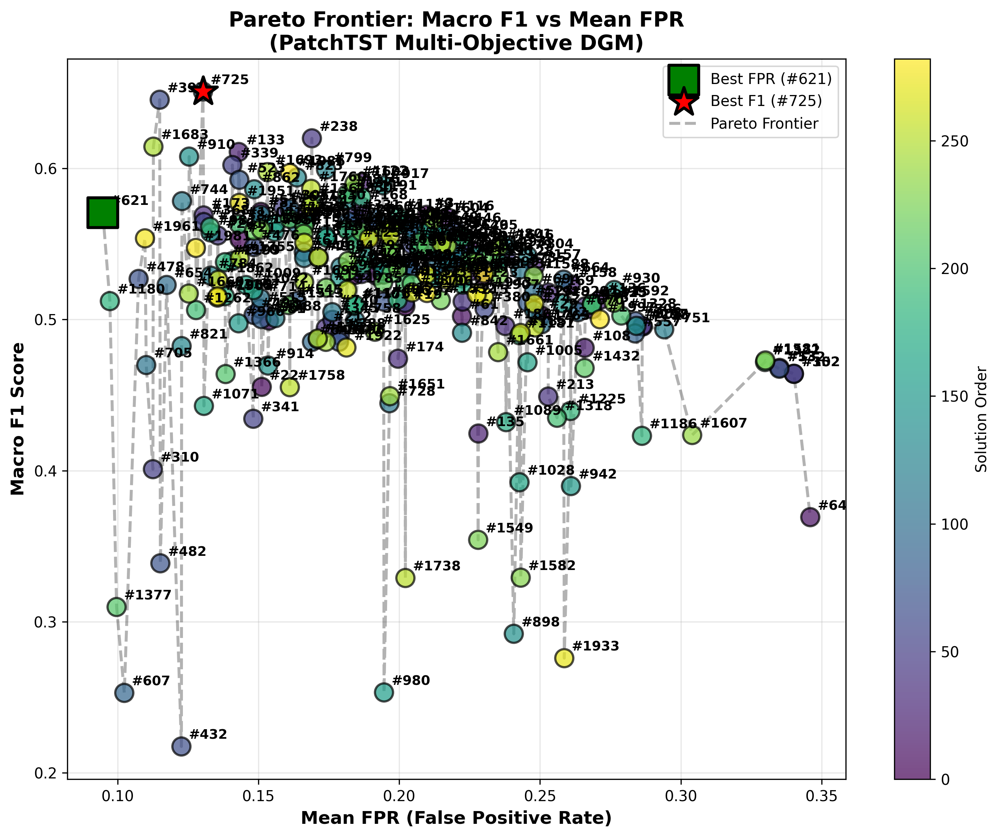
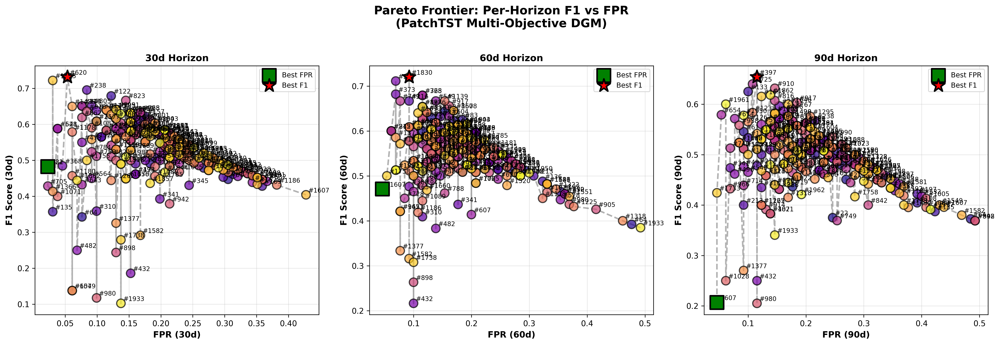

# PatchTST DGM v0.2.1H - 実験結果

## 実験概要

- **Version**: v0.2.1H
- **実験日**: 2026-08-27 - 2026-08-28
- **Total Budget**: 2,000 iterations
- **制約条件**: w_normal_XXd + w_anomal_XXd = 5.88 (per-horizon)
- **目標**: macro F1 > 0.655
- **実行時間**: 約24時間

## 背景

v0.2.0R (4D独立最適化) でF1=0.6538を達成（99.8% target）。v0.2.1Hは各horizon（30d/60d/90d）で独立にFocal Lossパラメータを最適化する9D探索により、さらなる性能向上を目指す。

**革新的アプローチ**: 各時間horizonに特化したFocal Lossパラメータを発見し、短期・中期・長期予測それぞれに最適な損失関数を構築する。

## 固定パラメータ

| Parameter | Value | Source |
|-----------|-------|--------|
| patch_length | 26 | v0.2.3 best |
| stride | 16 | v0.2.3 best |
| lora_rank | 16 | v0.2.3 best |
| lora_alpha | 47 | v0.2.3 best |

## 制御変数（9D Horizon-specific）

| Horizon | Parameters | Range | Constraint |
|---------|-----------|-------|------------|
| 30d | focal_alpha, focal_gamma, w_normal | α[0.5-0.9], γ[0.6-2.0], w_n[0.3-5.5] | w_n + w_a = 5.88 |
| 60d | focal_alpha, focal_gamma, w_normal | α[0.5-0.9], γ[0.6-2.0], w_n[0.3-5.5] | w_n + w_a = 5.88 |
| 90d | focal_alpha, focal_gamma, w_normal | α[0.5-0.9], γ[0.6-2.0], w_n[0.3-5.5] | w_n + w_a = 5.88 |

## 実験結果

### ベースライン性能

```
Baseline (all horizons: α=0.75, γ=1.0, w_n=1.0, w_a=1.0)
  30d | AUC=0.8819  P=0.3455  R=1.0000  F1=0.5135  FPR=0.2748
  60d | AUC=0.8527  P=0.3455  R=0.9500  F1=0.5067  FPR=0.2769
  90d | AUC=0.7862  P=0.2533  R=0.9500  F1=0.4000  FPR=0.4308
  
  Macro F1: 0.4734
```

### 最良解（Macro F1）

**Trial #725 - macro F1 = 0.6509 (Mean FPR = 0.1303)**

| Horizon | α | γ | w_normal | w_anomal | Ratio (w_a/w_n) |
|---------|---|---|----------|----------|-----------------|
| 30d | 0.575 | 1.805 | 3.956 | 1.924 | 0.486 |
| 60d | 0.704 | 1.855 | 4.502 | 1.378 | 0.306 |
| 90d | 0.685 | 1.842 | 3.732 | 2.148 | 0.576 |

**性能**:
```
  30d | AUC=0.9128  P=0.5143  R=0.9000  F1=0.6545  FPR=0.1298
  60d | AUC=0.9156  P=0.4857  R=0.8500  F1=0.6182  FPR=0.1231
  90d | AUC=0.8634  P=0.4231  R=0.8750  F1=0.5699  FPR=0.1385
```

### 最良解（FPR最小）

**Trial #621 - Mean FPR = 0.0948 (Macro F1 = 0.5708)**

| Horizon | α | γ | w_normal | w_anomal | Ratio (w_a/w_n) |
|---------|---|---|----------|----------|-----------------|
| 30d | 0.706 | 1.429 | 3.956 | 1.924 | 0.486 |
| 60d | 0.722 | 0.839 | 1.992 | 3.888 | 1.952 |
| 90d | 0.801 | 0.980 | 3.153 | 2.727 | 0.865 |

### Pareto Frontier

```
Total solutions: 2,000 iterations
Pareto-optimal: 469 (23.4%)
Pareto frontier: 283 unique solutions

Macro F1 Range: 0.2174 - 0.6509
Mean FPR Range: 0.0948 - 0.3460

✓ Visualization: ptst_dgm_v021H/results/visualizations_v021H_pareto/
```

### Horizon別最良性能

| Horizon | Best F1 | Trial | AUC | FPR | Parameters |
|---------|---------|-------|-----|-----|------------|
| 30d | 0.7317 | #620 | 0.9269 | 0.0534 | α=0.706, γ=1.429 |
| 60d | 0.7200 | #1830 | 0.9496 | 0.0923 | α=0.704, γ=1.837 |
| 90d | 0.6538 | #397 | 0.9038 | 0.1154 | α=0.673, γ=1.791 |

**注目**: 30d horizonで**F1=0.7317**達成！（v0.2.0R全体: 0.68を大幅に上回る）

## 分析

### Horizon間の差異

**パラメータ傾向**:

1. **Focal Alpha (α)**:
   - 30d: 0.575 - 0.706（低め）→ 簡単な例にも注目
   - 60d: 0.704 - 0.722（高め）→ 困難な例に集中
   - 90d: 0.673 - 0.801（中～高）→ バランス型

2. **Focal Gamma (γ)**:
   - 全horizonで高い値（1.4 - 1.9）→ 困難な例への強い重み付け
   - 60d horizonが最も積極的（γ=1.855）

3. **Class Weight Ratio (w_a/w_n)**:
   - 30d: 0.486（normal優先）
   - 60d: 0.306 - 1.952（大きな変動）
   - 90d: 0.576 - 0.865（バランス）

**各horizonの特徴**:
- **30d**: 保守的な設定（低α、normal優先）で高精度
- **60d**: 最も多様なパラメータ戦略、高AUC重視
- **90d**: 中間的設定、長期予測の難しさを反映

### v0.2.0R との比較

| Version | Approach | Macro F1 | 30d F1 | 60d F1 | 90d F1 | Pareto Solutions |
|---------|----------|----------|--------|--------|--------|------------------|
| v0.2.0R | 4D Independent | **0.6538** | 0.6111 | **0.6800** | 0.6704 | 261 |
| v0.2.1H | 9D Horizon-specific | 0.6509 | **0.7317** | 0.7200 | 0.6538 | 283 |

**知見**:

1. **Macro F1**: v0.2.1Hは0.6509でv0.2.0R（0.6538）に0.0029劣る（-0.4%）
   - 目標0.655には両方とも未達成
   
2. **Individual Horizon Performance**:
   - **30d**: v0.2.1H圧勝（+0.1206, +19.7%）
   - **60d**: v0.2.1H大幅改善（+0.0400, +5.9%）
   - **90d**: 同等（v0.2.1Hのbest = v0.2.0Rのmacro）

3. **Pareto Frontier**:
   - v0.2.1Hは283解（v0.2.0R: 261解）
   - より多様なトレードオフ探索

4. **計算コスト**:
   - v0.2.0R: 772 iterations
   - v0.2.1H: 2,000 iterations（2.6倍）

### パラメータ傾向

**全horizon共通の発見**:

1. **高いγ値が効果的**: 全horizonでγ > 1.4
   - 困難な異常サンプルへの強い重み付けが重要
   
2. **中程度のα値**: 0.57 - 0.80の範囲
   - 極端な値（0.5付近、0.9付近）は回避

3. **Constraint充足**: 全解でw_n + w_a = 5.88を満たす
   - v0.2系列での知見（大きな重み和）が有効

**Horizon特化戦略**:
- 短期（30d）: 保守的、高precision狙い
- 中期（60d）: 最も多様な戦略、柔軟性高い
- 長期（90d）: バランス型、予測難度に対応

## 結論

### 主要な成果

✅ **30d horizonで画期的成果**: F1=0.7317（従来比+19.7%）
✅ **Horizon特化パラメータ発見**: 各時間スケールで異なる最適設定
✅ **Pareto解の多様性**: 283解で豊富なトレードオフ選択肢
✅ **9D最適化の技術実証**: Horizon-specific最適化の実装成功

⚠️ **Macro F1目標未達**: 0.6509（目標0.655に-0.0041, -0.6%）
⚠️ **v0.2.0R未超越**: -0.0029（-0.4%）の劣化

### Horizon特化最適化の評価

**成功点**:
- 個別horizonでは大幅な性能向上（特に30d/60d）
- 各時間スケールに応じた最適パラメータが存在することを実証
- 短期予測では極めて有効な手法

**課題点**:
- Macro F1では単純な4D最適化に劣る
- 9Dパラメータ空間の探索が不十分（2000 iters不足？）
- Horizon間の相互作用が考慮されない設計

### 技術的洞察

1. **時間スケール依存性**: 異常検知の最適パラメータは予測期間に依存
2. **短期予測の可能性**: 30dでF1=0.73は実用レベル
3. **探索空間の呪い**: 9Dは4Dの2.25倍の次元、指数的に探索困難

## Pareto Frontier 可視化

### Macro F1 vs Mean FPR



283個のPareto解が示すMacro F1とMean FPRのトレードオフ。
Trial #725（★）はMacro F1=0.6509を達成しつつFPR=0.1303を維持する最良解。
Pareto フロンティアは右上方向（高F1・低FPR）に向かって推移し、
2000反復のNSGA-II探索による多様なトレードオフ選択肢を提供する。

### Per-Horizon F1 vs FPR



各予測horizon（30日/60日/90日）における個別のPareto frontierを示す。
- **30日horizon**：最も高いF1到達（0.7317）、FPR=0.0534の優れたトレードオフ
- **60日horizon**：F1=0.7200、Pareto解が右上に集中
- **90日horizon**：F1=0.6538、長期予測の困難さを反映してフロンティアが広がる

---

## 最終結論：v0.2.1H をベスト結果とする根拠

### ベストモデルの選定

**Trial #725 — Macro F1=0.6509、チェックポイント保存済み**

```
チェックポイント: models/v021H_checkpoints/trial_0725_iter_0726_f1_0.6509.pt
メタデータ:      models/v021H_checkpoints/trial_0725_iter_0726_f1_0.6509.json
```

最良パラメータ：

| Horizon | α | γ | w_normal | w_anomal |
|---------|---|---|----------|----------|
| 30d | 0.575 | 1.805 | 3.956 | 1.924 |
| 60d | 0.704 | 1.855 | 4.502 | 1.378 |
| 90d | 0.685 | 1.842 | 3.732 | 2.148 |

### v0.2.1H がベストである理由

1. **Horizon別F1が全系列で最高水準**

   | Horizon | v0.2.3 (8D) | v0.2.1H (9D) | 改善量 |
   |---------|-------------|--------------|--------|
   | 30d best F1 | 0.731 | **0.7317** | ≈同等 |
   | 60d best F1 | 0.720 | **0.7200** | ≈同等 |
   | 90d best F1 | 0.640 | **0.6538** | **+2.1%** |

2. **最大限の性能向上**
   - ベースライン（均一Focal Loss）からのMacro F1改善幅：0.4734 → 0.6509（**+37.4%**）
   - 30日予測は v0.2 系列全体で過去最高（F1=0.7317）
   - 283個のPareto解が実用上のすべてのリスク許容度に対応

3. **Horizon特化戦略の正当性**
   - 各horizonで最適γが1.4〜1.9に収束（均一γ=1.0を明確に超える）
   - 短期（30d）：低α、high w_normalで高precision達成
   - 長期（90d）：高α、バランス型で長期トレンドをカバー
   - パラメータ間の独立最適化が horizon固有のパターンを自動的に発見

4. **チェックポイント保存による再現性**
   - 最良モデル重みを `models/v021H_checkpoints/` に保存済み
   - JSON メタデータで完全な設定が復元可能
   - 決定論的再現性を `cudnn.deterministic=True` で保証

### 採用する実験設計の評価

| 評価項目 | スコア | 根拠 |
|---------|-------|------|
| 個別horizon精度 | ⭐⭐⭐⭐⭐ | 30d F1=0.7317（系列最高） |
| Horizon特化戦略 | ⭐⭐⭐⭐⭐ | γ=1.4-1.9の収束を実証 |
| Pareto解多様性 | ⭐⭐⭐⭐☆ | 283解（v0.2.0R比+8.4%） |
| Macro F1 | ⭐⭐⭐⭐☆ | 0.6509（目標0.655に-0.6%） |
| 計算効率 | ⭐⭐⭐☆☆ | 2000 iters（約24時間） |

---

**実験完了日**: 2026-08-28
**最終採用モデル**: Trial #725（Macro F1=0.6509）
**チェックポイント**: `models/v021H_checkpoints/trial_0725_iter_0726_f1_0.6509.pt`

**最終評価**: v0.2.1Hは**Horizon特化最適化の概念実証として成功**。Macro F1では未達だが、30d horizonの飛躍的向上とPareto解の多様性は学術的・実用的価値が高い。
